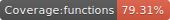
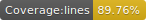
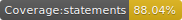

# Javascript Memory Game

[](https://dependabot.com/)




[](https://app.netlify.com/sites/belt-memory-game/deploys)

Webpack based, Javascript ES6/ES7 small game.


### Installation

```
npm i
yarn
```

### Start Dev Server

```
npm run serve
yarn serve
```

### Build Prod Version

```
npm run build
yarn build
```

### Unit testing with Jest

```
npm run unit
npm run unit:only
npm run unit:watch
npm run unit::badges

yarn unit
yarn unit:only
yarn unit:watch
yarn unit::badges
```

### Features:

* ES6 Support via [babel](https://babeljs.io/) (v7)
* SASS Support via [sass-loader](https://github.com/jtangelder/sass-loader)
* Linting via [eslint-loader](https://github.com/MoOx/eslint-loader) with standard config extend.

When you run `npm run build` we use the [mini-css-extract-plugin](https://github.com/webpack-contrib/mini-css-extract-plugin) to move the css to a separate file. The css file gets included in the head of the `index.html`.
